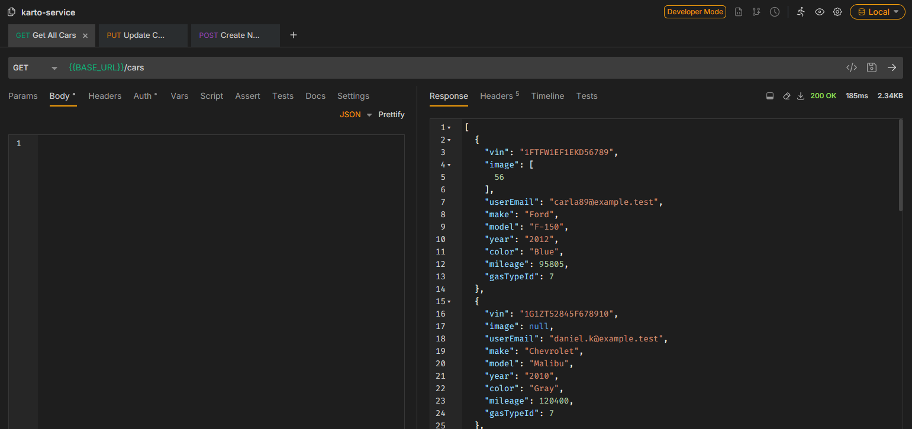
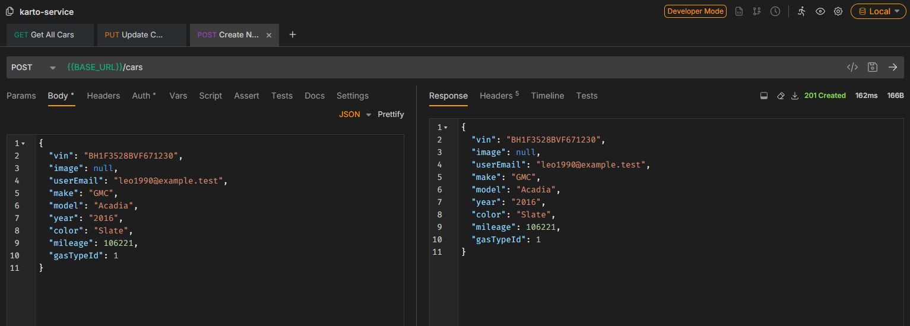
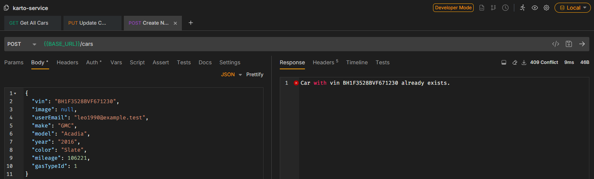
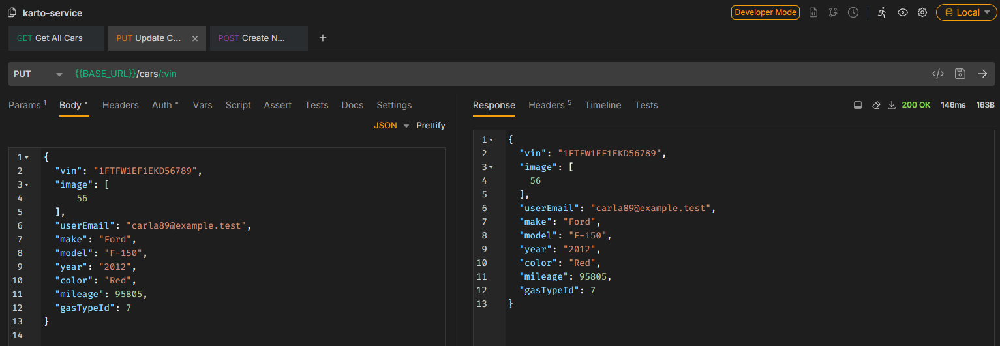
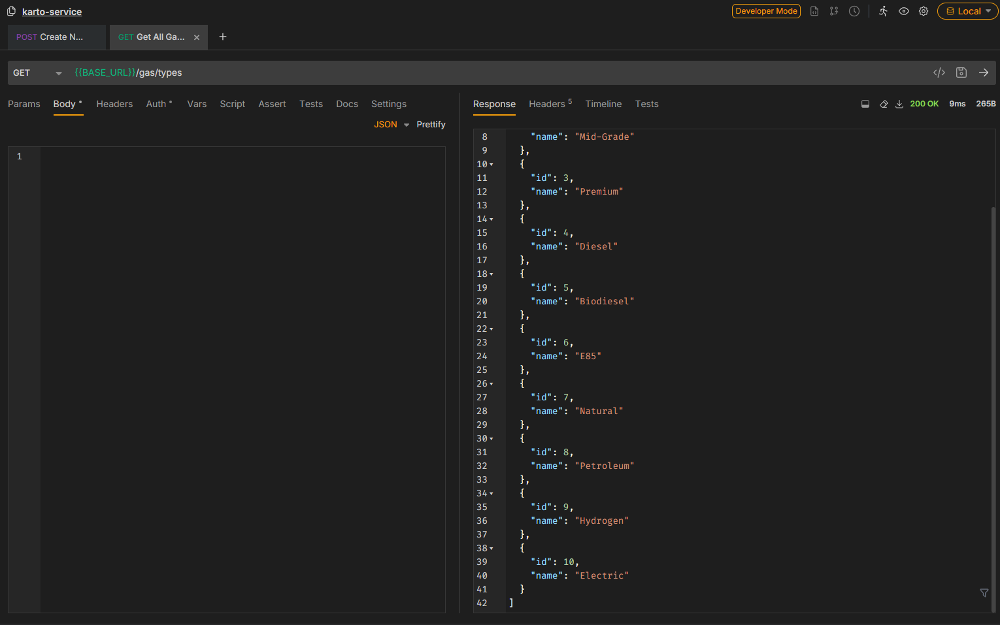
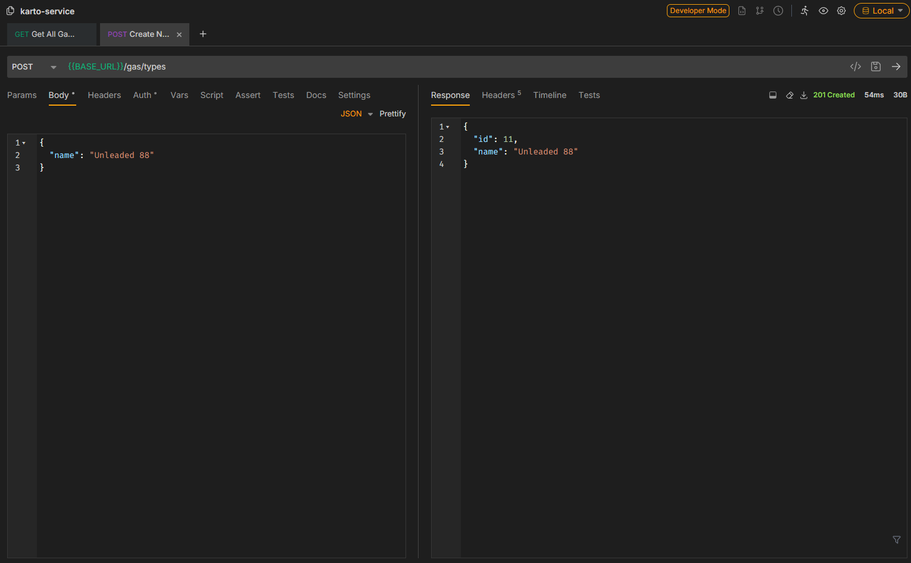
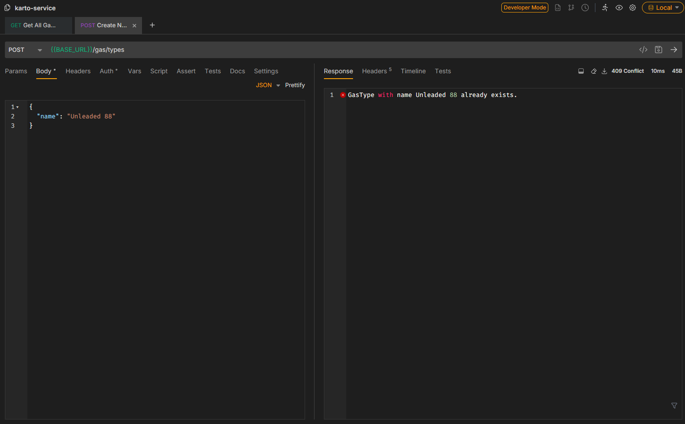
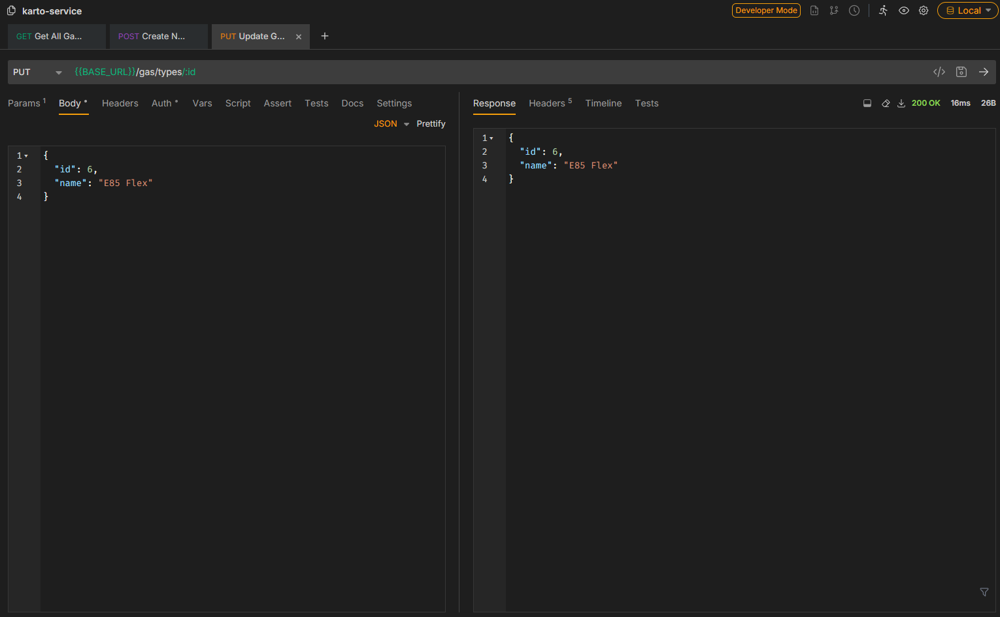
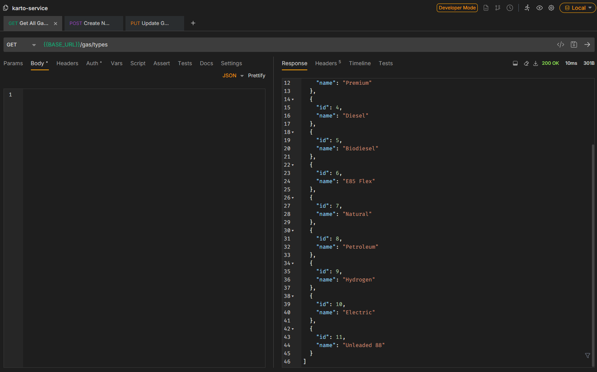

# Homework 4 - Put & Post Request

## Car

### Initial Car

### POST - Create new car

### POST - Conflict error if vin already exist

### PUT - Update Car

## Gas Type

### Initial Gas Type

### POST - Create new gas type

### POST - Conflict already exists

### PUT - Update gas type name

### Gas Type After

